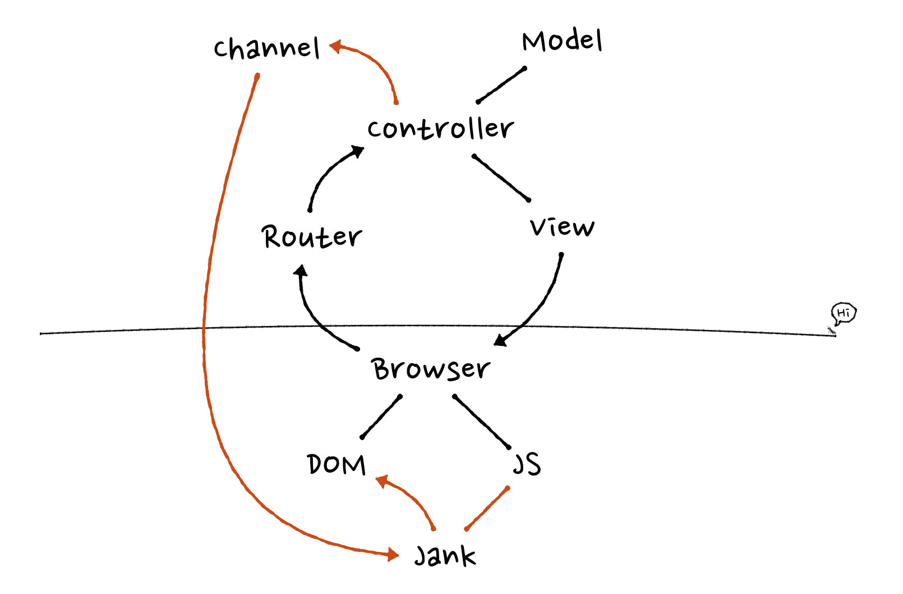

# jank

[![Build Status][travis-img]][travis]

[travis-img]: https://travis-ci.org/iamvery/jank.svg?branch=master
[travis]: https://travis-ci.org/iamvery/jank

Jank automatically updates your view when the server says so.

If you're using Jank with Elixir Phoenix, check out [phoenix_jank][ph-jank].

## Usage

TODO

## How it works

The basic premise of Jank is that for simple real-time requirements, you have been writing too much JavaScript.
For example, if you want stream chat messages from a websocket into your page, traditionally you must write the code that updates the DOM.
With Jank, this process is generalized into a set of transformations.

Jank finds components on your page and subscribes to a data topic.
The server sends data along when it's available and Jank integrates it back into the page automatically.
Janks plays really nice with the [Ratchet][ratchet] data format.
All of this is accomplished without the need for complicated front-end JavaScript frameworks.
It bolts on to your traditional, server-rendered architecture.



## Release

1. Bump the version in `package.json`.
1. Add version to CHANGELOG.
1. Commit version with Git tag `vX.X.X`.
1. Publish to npm:

   ```
   $ npm publish
   ```


[ph-jank]: https://github.com/iamvery/phoenix_jank
[ratchet]: https://github.com/iamvery/ratchet
